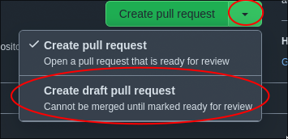
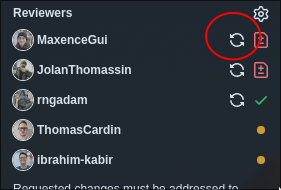

# Contributing to the CFIA AI Lab

- [Overview](#overview)
- [Development Practices](#development-practices)
  - [Managing Secrets](#managing-secrets)
  - [Editor settings](#editor-settings)
- [Using GitHub Issues](#using-github-issues)
- [Working with GitHub Projects](#working-with-github-projects)
- [Creating a new repository in the
  Organization](#creating-a-new-repository-in-the-organization)
- [Filing an Issue/ticket](#filing-an-issueticket)
- [Creating a Pull Request](#creating-a-pull-request)
- [Working on a Pull Request](#working-on-a-pull-request)
- [Submit for review](#submit-for-review)
- [Reviewing and Approving a Pull
  Request](#reviewing-and-approving-a-pull-request)
- [Closing Pull Requests](#closing-pull-requests)
- [GitHub development processes](#github-development-processes)
  - [Handling divergent branches](#handling-divergent-branches)
    - [Configuring Git for Automatic
      Rebase](#configuring-git-for-automatic-rebase)
    - [Rebase with VScode GitHub
      extension](#rebase-with-vscode-github-extension)

## Overview

This guide details the CFIA AI Lab’s development practices and GitHub workflow,
covering Issues, Projects, Pull Requests, and code reviews to ensure efficient,
collaborative, and high-quality development.

## Development Practices

### Managing Secrets

**⚠️Warning: Never add secrets directly in your code.** Even if it's for quick
testing, secrets in code can easily be committed accidentally.

To securely manage sensitive information, we use `.env` files for
environment-specific configuration and `.env.template` files as templates for
these configurations.

1. **Copy .env.template:** Duplicate the `.env.template` file to create a `.env`
   file locally.

1. **Fill in Secrets:** Add environment-specific values (e.g., API keys,
   database credentials) to your `.env` file as needed. Ask the DevOps team
   about accessing Vault, our secrets management tool, to retrieve them.

1. **Access Secrets in Code**: Use `load_dotenv()` to load values from `.env`,
   then access them with `os.getenv("NAME_OF_SECRET")`.

1. **Protect .env**: Ensure `.env` is listed in `.gitignore` to prevent it from
   being committed to version control.

### Editor settings

Ensure that your editor (preferably in project workspaces) has the following
turned on:

- Automatically wrap lines to 80 characters in Markdown files
  - use Rewrap extension
- Trim Final Newlines: Ensures your files end neatly with a single newline.
- Trim Trailing Whitespace: Eliminates any superfluous spaces at the end of
  lines upon file save.
- Insert Final Newline: Add EOF new line when saving.

## Using GitHub Issues

1. Go to the organization's GitHub repository.
2. Click on [Projects](https://github.com/orgs/ai-cfia/projects) and select a
   project to see all its issues.
3. Create a new issue and assign it to a specific developer. Make sure to:
   - give the issue meaningful title and description
   - assign it the appropriate labels
   - not create new labels at repository level

## Working with GitHub Projects

1. Open the organization's GitHub repository.
2. Click on [Projects](https://github.com/orgs/ai-cfia/projects) and select a
   project to view its board.
3. **Issue Prioritization**: The tasks can be reordered in the table by dragging
   their priority number up or down. The higher up a task is, the more urgent it
   is.
4. **Assignment**: In the `Assignees` column, chose an assignee.
5. **Status**: In the `status` column, update the progress on the issue to keep
   track of it.

**Notes**:

- If the particular repository on which you are working doesn't have a GitHub
  Project, create one with the permission of your supervisor. Follow this
  [guide](https://docs.github.com/en/issues/planning-and-tracking-with-projects/learning-about-projects/quickstart-for-projects).
- Don't assign issues before they are prioritized (by your supervisor or the
  whole team)

## Creating a new repository in the Organization

Refer to the [GitHub Repository Creation
Guide](https://github.com/ai-cfia/devops/blob/main/github-repository-creation-guide.md)
in the DevOps repository for information.

## Filing an Issue/ticket

A good issue:

- A good, descriptive title that is understandable even to management.
- A full summary that provides context.
- Detailed, step-by-step descriptions of the work to be done.
- Clearly defined acceptance criteria.
- A task list that is correctly associated with a project.
- The inclusion of links and (sequence) diagrams to further clarify the work.
- Information about the version and environment tested against, along with
  reproduction steps for filed issues.
- For web applications, utilization of the Developer tools panel in the browser.
- The use of text, screenshots, application logs, and console logs to convey
  information.
- An explanation of the root causes of the problem.

Additionally, issues should be appropriately sized, avoiding refactoring or
minor fixes that could be added as tasks to existing issues. When creating an
issue as a follow-up to a comment in another issue or pull request, utilize the
"Reference in new issue" GitHub feature (found in the ... menu) to provide
context and enhance clarity.

## Creating a Pull Request

1. Reference which issue this PR closes in the description
2. Plan the work required to complete the change as a checklist
    1. Make it work first!
    2. Refactoring
    3. documentation of usage and architecture
    4. manual testing (updatest to TESTING.md)
    5. automated testing
    6. versioning bump (_versions.ts in frontend projects)
3. Mark your pull request as a draft.

    

4. Make all the necessary changes you want.
5. Once you addressed all the requests, you can ask for a re-review.



## Working on a Pull Request

Push and share your code early and often. When you share early code still under
development, prefix your PR with WIP (meaning Work-in-Progress) so that
reviewers know this is not your final version.

## Submit for review

Select list of reviewers that are relevant to the PR, including team lead.

You should also include relevant reviewers even if they are absent or on
vacation so they can catch up when they come back. Their approval is not
required in the meantime to complete the PR.

## Reviewing and Approving a Pull Request

1. Team members review the pull request, leave comments, and suggest changes if
   necessary.
2. Developer addresses the feedback and makes the necessary updates. Developer
   replies to all review comments with "done", comments, new issues (to postpone
   work to future PR) or clarifying questions
3. Once the pull request meets the required criteria, a team member approves the
   pull request.

## Closing Pull Requests

1. Once the pull request is approved, navigate to the pull request's
   description.
2. Update the description by adding the text `Closes #<issue number>` to
   indicate that the issue has been addressed and completed.
3. Consider rebasing and squashing the commit history
4. Merge the pull request into the main branch. If you have a merge conflict
   with your branch being divergent from the main branch, please refer to the
   following [section](#handling-divergent-branches).

5. Don't delete the branch when done (leave them for future reference).

Following this workflow will help in managing tasks, tracking progress, and
closing issues effectively using GitHub's features.

For more detailed information and specific steps, please refer to the GitHub
documentation or reach out to your team for any additional guidelines or
conventions.

[see this repository .vscode/settings.json as example](../.vscode/settings.json)

## GitHub development processes

- check your [Github organization](https://github.com/ai-cfia)
  [notifications](https://github.com/notifications) twice daily.
  - Customize email routing to route ai-cfia repo notifications to your
    inspection.gc.ca
  - Prioritize pull requests reviews above all else
  - Do not just rubber stamp; provide value as a reviewer
- every work item should have a matching issue describing the work to be done
- pull requests
  - branch -> pull request -> peer review -> fixes -> approval -> rebase and
    merge
  - name branch prefix with issue identifier (```59-some-issue-summary```)
  - reference the issue within the description of the pull request
  - do as many request reviews -> get comments from reviewer -> fix and answer
    comments -> request reviews as necessary (until you get the reviewer(s)
    approval
- update your [Github notification settings with Custom
  Routing](<https://github.com/settings/notifications/custom_routing>) from the
  ai-cfia org to your inspection.gc.ca email
- single line commits preferably prefixed with issues being worked on.
  - example: `Issue #19: Introduction Jolan Thomassin`
- don't delete branches when done (leave them for future reference)
- when feedback, suggestions or feature request that come up in one of your PR
  by a reviewer that would require a lot more work outside the scope of the
  current issue, it is encouraged to create a new issue capturing that
  non-trivial piece of work and document it as "postponed work" in the PR.

### Handling divergent branches

When your branch diverges from the main branch (due to updates in the main
branch while you're working on your branch), follow these steps to rebase your
branch onto the main branch. This keeps the project history clean and linear.

```ascii
main      A---B---C---D
               \
branch          E---F---G (divergent)
```

A, B, C, D are commits on the main branch, and E, F, G are your commits on the
branch. C and D are new commits added to the main branch after you created your
branch.

Steps to manually Rebase and Merge

1.Fetch Latest main branch:

```sh
git fetch origin main
```

2.Rebase Your Branch:

Start the rebase process to replay your branch's changes (E, F, G) on top of the
current state of the main branch (D).

```sh
git rebase origin/main
```

3.Resolve Conflicts (if any):

```sh
git add <file>
git rebase --continue
```

Repeat until all conflicts are resolved and the rebase completes.

Push Changes:

Since rebase rewrites history, you'll need to force push your branch.

```sh
git push --force-with-lease
```

This process ensures your changes maintains a linear history :

```ascii
main      A---B---C---D
                        \
branch                   E'---F'---G' (rebased)
```

#### Configuring Git for Automatic Rebase

To set up Git to automatically rebase instead of creating merge commits when
doing a git pull, you can use the following global configuration command:

```sh
git config --global pull.rebase true
```

#### Rebase with VScode GitHub extension

1. Open the command palette (Ctrl+Shift+P)
2. Search for "Rebase" and select "Git: Pull (Rebase)"
3. Select the branch you want to rebase onto the main branch
4. Resolve any conflicts and push your changes
